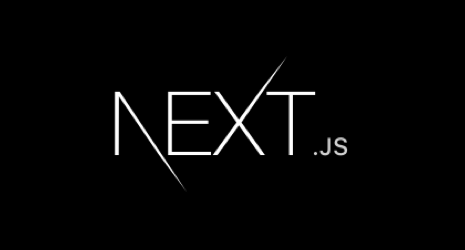
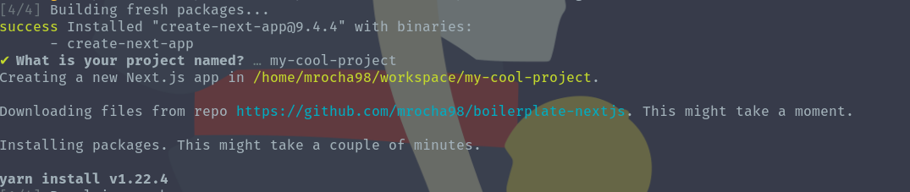
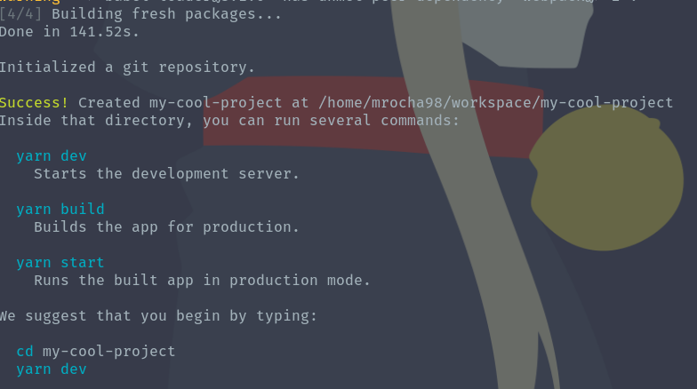
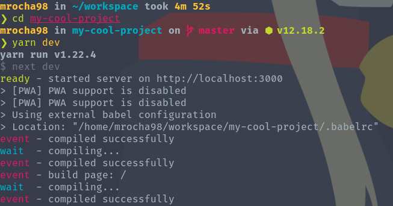
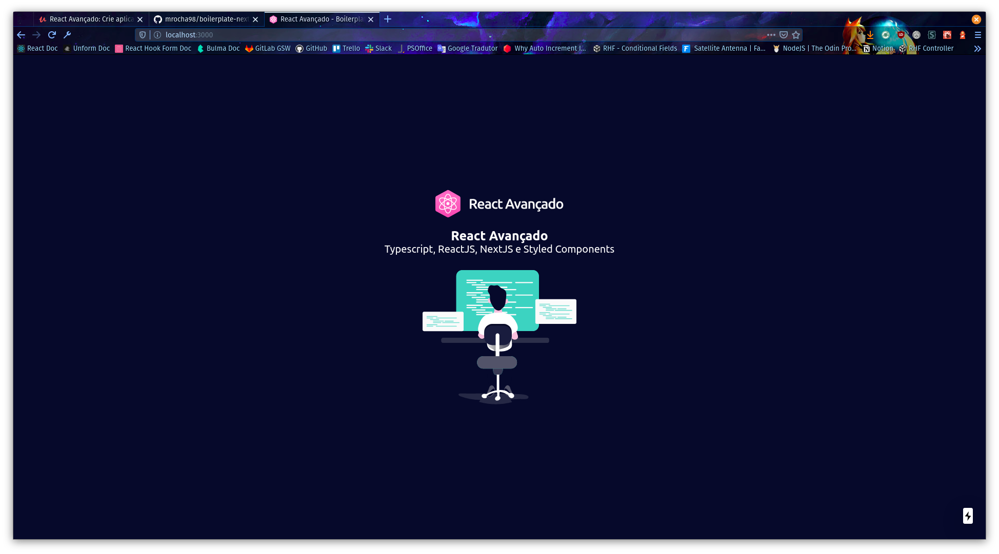

<p align="center">
  
</p>

<h1 align="center">
  Boilerplate NextJS
</h1>

[](http://commitizen.github.io/cz-cli/)


[](https://github.com/styled-components/styled-components)

A Boilerplate for NextJS applications with ready setup to:

- Typescript
- Styled Components
- Jest
- React Testing Library
- StoryBook
- Commitizen

This project was carried out following the course ["React Avançado"]((https://external-content.duckduckgo.com/iu/?u=https%3A%2F%2Fbuttercms.com%2Fstatic%2Fimages%2Ftech_banners%2FNextjs.b8a717322c08.png&f=1&nofb=1)) on Udemy.

OBS: Contains some personal modifications like commitizen and BSD license. Check the original repo [here](https://github.com/React-Avancado/boilerplate).

## 🚀 Usage

```bash
yarn create next-app -e https://github.com/mrocha98/boilerplate-nextjs
```



Creating my-cool-project



Creation finished



Running project



Project opened in browser

## 📜 License

This project is licensed under [BSD-3-Clause](https://github.com/facebook/react/blob/master/LICENSE).
